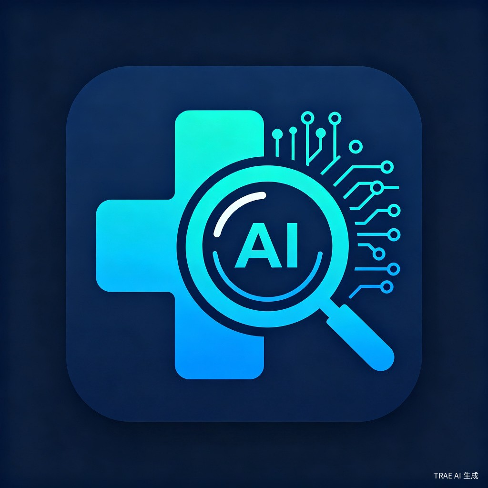

<div align="center">



# 🩺 MediScan-AI

**Lightweight Local Medical Text Intelligence Analysis Engine**
**轻量级本地医疗文本智能分析引擎**

[](https://www.python.org/downloads/)
[](LICENSE)
[](tests/)
[](https://github.com/gitstq/MediScan-AI/releases)
[](Dockerfile)

**Zero External Model Dependencies | 200+ Medical Terms | 12+ PII Types | Web UI + CLI + API**

[English](#english) | [简体中文](#简体中文) | [繁體中文](#繁體中文)

</div>

---

## 简体中文

### 🎉 项目介绍

MediScan-AI 是一款**零外部模型依赖**的轻量级本地医疗文本智能分析引擎。它使用纯规则引擎和字典匹配技术，提供医疗命名实体识别（NER）、个人隐私信息（PII）脱敏、病历结构化解析和药物相互作用检查四大核心功能。

**核心优势：**
- 🔒 **完全本地运行** — 无需GPU，无需云端API，数据不出本机
- 🚀 **零外部模型依赖** — 纯Python实现，仅依赖Flask和jieba
- 🇨🇳 **中文医疗深度优化** — 200+中文医学术语，覆盖常见科室
- 🌐 **中英双语支持** — 自动检测语言，支持中英文混合文本
- 🖥️ **多种使用方式** — Web界面、CLI命令行、RESTful API

### ✨ 核心特性

| 功能模块 | 描述 | 支持类型 |
|---------|------|---------|
| 🧠 医疗NER引擎 | 命名实体识别 | 症状、疾病、药品、检查、治疗、身体部位、检验结果 |
| 🔐 PII脱敏引擎 | 隐私信息检测与脱敏 | 身份证、手机号、邮箱、姓名、地址、银行卡等12+种 |
| 📋 病历解析器 | 非结构化病历结构化 | 门诊、住院、处方、检验报告、出院小结 |
| 💊 药物交互检查 | 药物相互作用检测 | 12条常见交互规则，支持别名匹配 |

### 🚀 快速开始

**安装：**
```bash
git clone https://github.com/gitstq/MediScan-AI.git
cd MediScan-AI
pip install -r requirements.txt
```

**CLI 使用：**
```bash
# 医疗实体识别
python -m mediscan.cli ner "患者头痛、发热3天，诊断为上呼吸道感染"

# PII脱敏
python -m mediscan.cli pii "患者张三，身份证号110101199001011234，手机号13800138000"

# 病历解析
python -m mediscan.cli parse "门诊记录\n主诉：头痛3天\n诊断：上呼吸道感染"

# 药物交互检查
python -m mediscan.cli drug 阿司匹林 华法林

# 启动Web服务
python -m mediscan.cli serve --port 5000
```

**Docker 部署：**
```bash
docker-compose up -d
# 访问 http://localhost:5000
```

### 📖 详细使用指南

#### API 端点

| 端点 | 方法 | 描述 |
|------|------|------|
| `/api/health` | GET | 健康检查 |
| `/api/ner` | POST | 医疗实体识别 |
| `/api/pii/mask` | POST | PII脱敏 |
| `/api/pii/detect` | POST | PII检测（不脱敏） |
| `/api/parse` | POST | 病历结构化解析 |
| `/api/drug/check` | POST | 药物交互检查 |
| `/api/analyze` | POST | 全流程分析（NER+PII+解析） |

#### API 调用示例

```bash
# NER分析
curl -X POST http://localhost:5000/api/ner \
  -H "Content-Type: application/json" \
  -d '{"text": "患者头痛、发热，血压140/90mmHg"}'

# 全流程分析
curl -X POST http://localhost:5000/api/analyze \
  -H "Content-Type: application/json" \
  -d '{"text": "张三，男，45岁，头痛3天，诊断为高血压"}'
```

### 💡 设计思路与迭代规划

**v1.0.0（当前）**
- 规则引擎 + 字典匹配的NER
- 12+种PII类型脱敏
- 5种病历类型结构化解析
- 12条药物交互规则
- Web UI + CLI + RESTful API

**v1.1.0（规划中）**
- 增加更多医学术语（目标500+）
- 支持ICD-10编码映射
- 增加批量处理API
- 支持PDF/Word病历导入

**v2.0.0（远期）**
- 集成轻量ML模型（可选）
- 支持影像报告分析
- 多用户与权限管理

### 📦 打包与部署指南

```bash
# 安装为Python包
pip install .

# Docker构建
docker build -t mediscan-ai .
docker run -p 5000:5000 mediscan-ai

# Docker Compose
docker-compose up -d
```

### 🤝 贡献指南

欢迎贡献！请遵循以下步骤：

1. Fork 本仓库
2. 创建特性分支 (`git checkout -b feature/amazing-feature`)
3. 提交更改 (`git commit -m 'feat: add amazing feature'`)
4. 推送分支 (`git push origin feature/amazing-feature`)
5. 创建 Pull Request

提交规范遵循 [Angular Convention](https://github.com/angular/angular/blob/master/CONTRIBUTING.md#commit)。

### 📄 开源协议

本项目基于 [MIT License](LICENSE) 开源。

> ⚠️ **免责声明**：本工具仅供学习和研究使用，不构成任何医疗建议。药物交互检查结果仅供参考，临床决策请遵循专业医师指导。

---

## English

### 🎉 Introduction

MediScan-AI is a **zero external model dependency** lightweight local medical text intelligence analysis engine. Using pure rule-based and dictionary matching techniques, it provides four core capabilities: Medical Named Entity Recognition (NER), Protected Health Information (PII) masking, clinical record parsing, and drug interaction checking.

**Key Advantages:**
- 🔒 **Fully Local** — No GPU required, no cloud API, data never leaves your machine
- 🚀 **Zero External Dependencies** — Pure Python, only requires Flask and jieba
- 🇨🇳 **Chinese Medical Optimization** — 200+ Chinese medical terms covering common departments
- 🌐 **Bilingual Support** — Auto language detection, supports mixed Chinese-English text
- 🖥️ **Multiple Interfaces** — Web UI, CLI, and RESTful API

### ✨ Core Features

| Module | Description | Supported Types |
|--------|-------------|-----------------|
| 🧠 Medical NER | Named Entity Recognition | Symptoms, Diseases, Drugs, Exams, Treatments, Body Parts, Test Results |
| 🔐 PII Masker | Privacy Detection & Masking | ID Card, Phone, Email, Name, Address, Bank Card (12+ types) |
| 📋 Record Parser | Unstructured Record Parsing | Outpatient, Inpatient, Prescription, Lab Report, Discharge Summary |
| 💊 Drug Checker | Drug Interaction Detection | 12 common interaction rules with alias matching |

### 🚀 Quick Start

**Installation:**
```bash
git clone https://github.com/gitstq/MediScan-AI.git
cd MediScan-AI
pip install -r requirements.txt
```

**CLI Usage:**
```bash
# Medical NER
python -m mediscan.cli ner "Patient presents with headache and fever for 3 days"

# PII Masking
python -m mediscan.cli pii "Patient John Smith, phone 13800138000"

# Record Parsing
python -m mediscan.cli parse "Outpatient Record\nChief Complaint: Headache x3 days"

# Drug Interaction Check
python -m mediscan.cli drug aspirin warfarin

# Start Web Server
python -m mediscan.cli serve --port 5000
```

**Docker:**
```bash
docker-compose up -d
# Visit http://localhost:5000
```

### 📖 API Reference

| Endpoint | Method | Description |
|----------|--------|-------------|
| `/api/health` | GET | Health check |
| `/api/ner` | POST | Medical NER analysis |
| `/api/pii/mask` | POST | PII masking |
| `/api/pii/detect` | POST | PII detection (no masking) |
| `/api/parse` | POST | Clinical record parsing |
| `/api/drug/check` | POST | Drug interaction check |
| `/api/analyze` | POST | Full pipeline (NER+PII+Parse) |

### 📄 License

This project is licensed under the [MIT License](LICENSE).

> ⚠️ **Disclaimer**: This tool is for educational and research purposes only. It does not constitute medical advice. Drug interaction results are for reference only; clinical decisions should follow professional medical guidance.

---

## 繁體中文

### 🎉 專案介紹

MediScan-AI 是一款**零外部模型依賴**的輕量級本地醫療文本智能分析引擎。使用純規則引擎和字典匹配技術，提供醫療命名實體識別（NER）、個人隱私資訊（PII）脫敏、病歷結構化解析和藥物交互作用檢查四大核心功能。

**核心優勢：**
- 🔒 **完全本地運行** — 無需GPU，無需雲端API，資料不出本機
- 🚀 **零外部模型依賴** — 純Python實現，僅依賴Flask和jieba
- 🇨🇳 **中文醫療深度優化** — 200+中文醫學術語，覆蓋常見科室
- 🌐 **中英雙語支援** — 自動檢測語言，支援中英文混合文本
- 🖥️ **多種使用方式** — Web介面、CLI命令列、RESTful API

### 🚀 快速開始

```bash
git clone https://github.com/gitstq/MediScan-AI.git
cd MediScan-AI
pip install -r requirements.txt
python -m mediscan.cli serve --port 5000
```

### 📄 開源協議

本專案基於 [MIT License](LICENSE) 開源。

> ⚠️ **免責聲明**：本工具僅供學習和研究使用，不構成任何醫療建議。藥物交互作用檢查結果僅供參考，臨床決策請遵循專業醫師指導。

---

<div align="center">

**Made with ❤️ by [gitstq](https://github.com/gitstq)**

**⭐ Star this repo if you find it helpful!**

</div>
